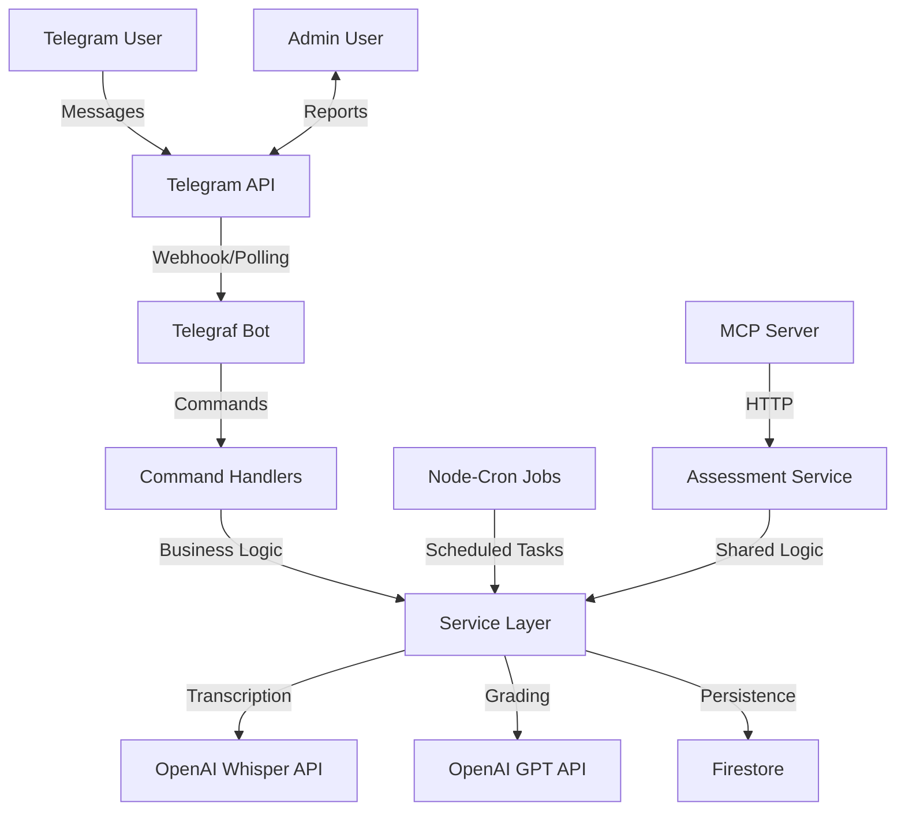
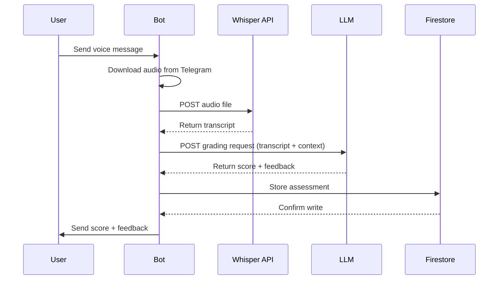

# Design Document: Language Learning Bot

## Overview

The Language Learning Bot is a production-ready Telegram bot that provides daily language lessons, AI-powered voice assessments, and progress tracking for busy adults. The system consists of three main components:

1. **Telegram Bot**: Handles user interactions, lesson delivery, and command processing
2. **Assessment Engine**: Transcribes voice recordings and provides AI-powered feedback
3. **MCP Server**: Exposes voice assessment functionality via Model Context Protocol

The architecture follows a modular design with clear separation between handlers (user interaction), services (business logic), and infrastructure (external APIs and database). All components use async/await patterns, structured logging with Winston, and Joi validation for data integrity.

**Target User**: Busy adults (e.g., 27-year-old Israeli learning English) who can dedicate 15 minutes per day to language practice.

**Key Design Principles**:
- Fail-fast validation at service boundaries
- Graceful degradation when external APIs fail
- Idempotent operations for data consistency
- Stateless request handling for scalability

## Architecture

### System Components



### Component Responsibilities

**Telegram Bot (index.js)**:
- Initialize Telegraf instance with bot token
- Register command handlers and message listeners
- Start webhook server (production) or polling (development)
- Handle graceful shutdown

**Command Handlers (handlers/)**:
- Parse incoming Telegram updates
- Validate user input at the presentation layer
- Delegate to service layer for business logic
- Format responses for Telegram API

**Service Layer (services/)**:
- Implement core business logic
- Validate inputs with Joi schemas
- Coordinate between external APIs and database
- Return standardized response objects: `{success: boolean, data?: any, error?: string, code?: string}`

**MCP Server (mcp/assessmentMcp.js)**:
- Implement Model Context Protocol specification
- Expose `assess_voice` tool with JSON-RPC interface
- Reuse assessment service for consistency
- Run on separate port (default 3001)

**Cron Jobs**:
- Daily lesson delivery (09:00 default, user-configurable)
- Weekly report generation (Sunday 20:00)
- Use node-cron for scheduling

### Data Flow: Voice Assessment



### Technology Stack

- **Runtime**: Node.js (v18+)
- **Bot Framework**: Telegraf v4.x
- **Database**: Firebase Firestore (via firebase-admin v12.x)
- **AI Services**: OpenAI API (Whisper + GPT-4)
- **Scheduling**: node-cron v3.x
- **Validation**: Joi v17.x
- **Logging**: Winston v3.x
- **Testing**: Jest v29.x
- **HTTP Client**: Axios v1.x

## Components and Interfaces

### 1. Bot Entry Point (src/index.js)

**Responsibilities**:
- Initialize Telegraf bot with token from environment
- Register all command handlers
- Start MCP server on configured port
- Initialize cron jobs for lessons and reports
- Handle process signals for graceful shutdown

**Key Functions**:

```javascript
/**
 * Initialize and start the bot
 * @returns {Promise<void>}
 */
async function startBot()

/**
 * Gracefully shutdown bot and cleanup resources
 * @returns {Promise<void>}
 */
async function shutdown()
```

**Startup Sequence**:
1. Load and validate environment variables (config.js)
2. Initialize Firebase Admin SDK
3. Create Telegraf bot instance
4. Register command handlers: /start, /progress, /change, /settings
5. Register message handlers: voice messages, callback queries
6. Start MCP server on port 3001
7. Schedule cron jobs: daily lessons (09:00), weekly reports (Sunday 20:00)
8. Start bot (webhook if production, polling if development)

### 2. Configuration Module (src/config/config.js)

**Responsibilities**:
- Load environment variables with dotenv
- Validate required variables exist
- Provide typed configuration object
- Fail fast on missing required config

**Interface**:

```javascript
const config = {
  telegram: {
    botToken: string,
    webhookPath: string | null,
    adminId: string
  },
  openai: {
    apiKey: string
  },
  firebase: {
    projectId: string,
    privateKey: string,
    clientEmail: string
  },
  mcp: {
    port: number,
    host: string
  },
  nodeEnv: 'development' | 'production'
}
```

**Validation**: Use Joi schema to validate on module load. Exit process if validation fails.

### 3. Language Configuration (src/config/languages.js)

**Responsibilities**:
- Define lesson content for each language and day
- Provide structured vocabulary with translations
- Support extensibility for new languages

**Data Structure**:

```javascript
const languages = {
  en: {
    name: 'English',
    flag: '🇺🇸',
    lessons: {
      1: {
        words: [
          { word: 'hello', translation: 'שלום', example: 'Hello, how are you?' },
          { word: 'goodbye', translation: 'להתראות', example: 'Goodbye, see you tomorrow!' },
          // ... 3 more words
        ],
        quizPrompt: 'Introduce yourself in English'
      },
      2: { /* Day 2 content */ }
    }
  },
  es: { /* Spanish content */ },
  fr: { /* French content */ },
  de: { /* German content */ }
}
```

### 4. Start Handler (src/handlers/startHandler.js)

**Responsibilities**:
- Handle /start command
- Display language selection inline keyboard
- Handle language selection callbacks
- Initialize new user in Firestore
- Send Day 1 lesson after language selection

**Key Functions**:

```javascript
/**
 * Handle /start command
 * @param {Context} ctx - Telegraf context
 * @returns {Promise<void>}
 */
async function handleStart(ctx)

/**
 * Handle language selection callback
 * @param {Context} ctx - Telegraf context
 * @param {string} languageCode - Selected language code
 * @returns {Promise<void>}
 */
async function handleLanguageSelection(ctx, languageCode)
```

**Inline Keyboard Layout**:
```
[🇺🇸 English] [🇪🇸 Spanish]
[🇫🇷 French]  [🇩🇪 German]
```

### 5. Lesson Handler (src/handlers/lessonHandler.js)

**Responsibilities**:
- Format and send daily lessons
- Handle lesson completion (✅ button)
- Prompt for voice recording after completion
- Track lesson completion in Firestore

**Key Functions**:

```javascript
/**
 * Send lesson to user
 * @param {number} userId - Telegram user ID
 * @param {string} languageCode - Target language
 * @param {number} lessonDay - Current lesson day
 * @returns {Promise<{success: boolean, error?: string}>}
 */
async function sendLesson(userId, languageCode, lessonDay)

/**
 * Handle lesson completion callback
 * @param {Context} ctx - Telegraf context
 * @returns {Promise<void>}
 */
async function handleLessonComplete(ctx)
```

**Lesson Message Format**:
```
📚 Day 1 - English Lesson

1. hello (שלום)
   Example: Hello, how are you?

2. goodbye (להתראות)
   Example: Goodbye, see you tomorrow!

[... 3 more words ...]

[✅ Mark Complete]
```

### 6. Assessment Handler (src/handlers/assessmentHandler.js)

**Responsibilities**:
- Handle incoming voice messages
- Download audio from Telegram servers
- Delegate to assessment service
- Send formatted results to user
- Handle assessment errors gracefully

**Key Functions**:

```javascript
/**
 * Handle voice message from user
 * @param {Context} ctx - Telegraf context
 * @returns {Promise<void>}
 */
async function handleVoiceMessage(ctx)

/**
 * Format assessment result for display
 * @param {Object} assessment - Assessment result object
 * @returns {string} Formatted message
 */
function formatAssessmentResult(assessment)
```

**Assessment Result Message Format**:
```
🎯 Assessment Complete!

Score: 78/100 📊

Feedback: Great pronunciation! Try using more varied vocabulary in your responses.

✅ Strengths: Clear pronunciation, good fluency
⚠️ Areas to improve: Grammar accuracy, vocabulary range

Keep practicing! 🚀
```

### 7. Progress Handler (src/handlers/progressHandler.js)

**Responsibilities**:
- Handle /progress command
- Fetch user statistics from Firestore
- Calculate derived metrics (streak, average score)
- Display formatted progress report

**Key Functions**:

```javascript
/**
 * Handle /progress command
 * @param {Context} ctx - Telegraf context
 * @returns {Promise<void>}
 */
async function handleProgress(ctx)

/**
 * Calculate user streak from assessments
 * @param {string} userId - User ID
 * @returns {Promise<number>} Current streak in days
 */
async function calculateStreak(userId)
```

### 8. Settings Handler (src/handlers/settingsHandler.js)

**Responsibilities**:
- Handle /change command
- Display language selection keyboard
- Update user language in Firestore
- Reset lesson day to 1
- Send confirmation message

**Key Functions**:

```javascript
/**
 * Handle /change command
 * @param {Context} ctx - Telegraf context
 * @returns {Promise<void>}
 */
async function handleChangeLanguage(ctx)
```

### 9. Assessment Service (src/services/assessmentService.js)

**Responsibilities**:
- Coordinate voice assessment workflow
- Call OpenAI service for transcription and grading
- Store assessment in Firestore
- Update user statistics
- Return standardized result object

**Key Functions**:

```javascript
/**
 * Assess voice recording
 * @param {Object} params - Assessment parameters
 * @param {string} params.userId - User ID
 * @param {number} params.lessonDay - Lesson day number
 * @param {string} params.targetLanguage - Target language code
 * @param {Buffer} params.audioBuffer - Audio file buffer
 * @param {Array} params.lessonWords - Lesson vocabulary
 * @param {string} params.expectedAnswer - Expected response
 * @returns {Promise<{success: boolean, data?: Object, error?: string, code?: string}>}
 */
async function assessVoice(params)

/**
 * Parse LLM grading response
 * @param {string} llmResponse - Raw LLM response text
 * @returns {{score: number, feedback: string, strengths: string[], weakAreas: string[]}}
 */
function parseGradingResponse(llmResponse)
```

**Assessment Result Object**:
```javascript
{
  success: true,
  data: {
    assessmentId: 'auto-generated-id',
    score: 78,
    transcript: 'Hello my name is...',
    feedback: 'Great pronunciation! Try using more varied vocabulary.',
    strengths: ['Clear pronunciation', 'Good fluency'],
    weakAreas: ['Grammar accuracy', 'Vocabulary range']
  }
}
```

### 10. Lesson Service (src/services/lessonService.js)

**Responsibilities**:
- Retrieve lesson content from languages.js
- Validate lesson day and language code
- Format lesson for display
- Handle missing lesson content

**Key Functions**:

```javascript
/**
 * Get lesson content
 * @param {string} languageCode - Target language code
 * @param {number} lessonDay - Lesson day number
 * @returns {{success: boolean, data?: Object, error?: string}}
 */
function getLesson(languageCode, lessonDay)

/**
 * Format lesson for Telegram message
 * @param {Object} lesson - Lesson object
 * @param {number} lessonDay - Lesson day number
 * @returns {string} Formatted message
 */
function formatLesson(lesson, lessonDay)
```

### 11. OpenAI Service (src/services/openaiService.js)

**Responsibilities**:
- Interact with OpenAI API
- Transcribe audio with Whisper
- Grade transcripts with GPT
- Handle API errors and retries

**Key Functions**:

```javascript
/**
 * Transcribe audio using Whisper API
 * @param {Buffer} audioBuffer - Audio file buffer
 * @param {string} language - Target language code
 * @returns {Promise<{success: boolean, data?: string, error?: string}>}
 */
async function transcribeAudio(audioBuffer, language)

/**
 * Grade transcript using LLM
 * @param {Object} params - Grading parameters
 * @param {string} params.transcript - Transcribed text
 * @param {string} params.targetLanguage - Target language
 * @param {string} params.nativeLanguage - Native language
 * @param {Array} params.lessonWords - Lesson vocabulary
 * @param {string} params.expectedAnswer - Expected response
 * @returns {Promise<{success: boolean, data?: string, error?: string}>}
 */
async function gradeTranscript(params)
```

**LLM Prompt Template**:
```
You are an expert teacher for {nativeLanguage} speakers learning {targetLanguage}.
Grade this beginner-level response:

TRANSCRIPT: {transcript}
LESSON WORDS: {lessonWords}
EXPECTED: {expectedAnswer}

Score 0-100 using rubric:
- Pronunciation: 25 points
- Grammar: 25 points
- Vocabulary: 20 points
- Fluency: 20 points
- Comprehension: 10 points

RESPOND ONLY with:
SCORE: X/100
FEEDBACK: [1-2 sentences of actionable advice]
STRENGTHS: [comma-separated list]
WEAK_AREAS: [comma-separated list]
```

### 12. Firebase Service (src/services/firebaseService.js)

**Responsibilities**:
- Initialize Firebase Admin SDK
- Provide CRUD operations for users and assessments
- Handle Firestore errors with retries
- Validate data before writes

**Key Functions**:

```javascript
/**
 * Create or update user
 * @param {Object} userData - User data object
 * @returns {Promise<{success: boolean, error?: string}>}
 */
async function upsertUser(userData)

/**
 * Get user by Telegram ID
 * @param {string} telegramId - Telegram user ID
 * @returns {Promise<{success: boolean, data?: Object, error?: string}>}
 */
async function getUser(telegramId)

/**
 * Store assessment
 * @param {Object} assessmentData - Assessment data object
 * @returns {Promise<{success: boolean, data?: string, error?: string}>}
 */
async function storeAssessment(assessmentData)

/**
 * Get user assessments
 * @param {string} userId - User ID
 * @param {number} limit - Maximum number of assessments to retrieve
 * @returns {Promise<{success: boolean, data?: Array, error?: string}>}
 */
async function getUserAssessments(userId, limit = 50)

/**
 * Update user statistics
 * @param {string} userId - User ID
 * @param {Object} updates - Fields to update
 * @returns {Promise<{success: boolean, error?: string}>}
 */
async function updateUserStats(userId, updates)
```

**Retry Logic**: Implement exponential backoff for transient Firestore errors (3 retries max, delays: 100ms, 200ms, 400ms).

### 13. Report Service (src/services/reportService.js)

**Responsibilities**:
- Generate weekly progress reports
- Aggregate user statistics
- Identify trends and patterns
- Format report for admin

**Key Functions**:

```javascript
/**
 * Generate weekly report for all users
 * @returns {Promise<{success: boolean, data?: string, error?: string}>}
 */
async function generateWeeklyReport()

/**
 * Calculate user consistency metrics
 * @param {string} userId - User ID
 * @param {number} days - Number of days to analyze
 * @returns {Promise<{daysActive: number, streak: number}>}
 */
async function calculateConsistency(userId, days = 7)

/**
 * Analyze weak areas across users
 * @param {Array} assessments - Array of assessment objects
 * @returns {Object} Aggregated weak areas with counts
 */
function aggregateWeakAreas(assessments)
```

**Report Format**:
```
📊 Weekly Language Learning Report
Week of: [Date Range]

👥 Active Users: 45
📚 Total Lessons: 312
🎯 Average Score: 76/100

Top Performers:
1. User123 - 95 avg, 7-day streak 🔥
2. User456 - 89 avg, 5-day streak
3. User789 - 87 avg, 7-day streak 🔥

Common Weak Areas:
- Grammar accuracy (23 users)
- Vocabulary range (18 users)
- Pronunciation (12 users)

Recommendations:
- Consider adding grammar-focused lessons
- Expand vocabulary exercises
```

### 14. MCP Server (src/mcp/assessmentMcp.js)

**Responsibilities**:
- Implement MCP protocol specification
- Expose assess_voice tool
- Handle JSON-RPC requests
- Reuse assessment service logic

**Key Functions**:

```javascript
/**
 * Start MCP server
 * @param {number} port - Server port
 * @param {string} host - Server host
 * @returns {Promise<void>}
 */
async function startMcpServer(port, host)

/**
 * Handle assess_voice tool call
 * @param {Object} params - Tool parameters
 * @returns {Promise<Object>} Assessment result
 */
async function handleAssessVoice(params)
```

**MCP Tool Definition**:
```javascript
{
  name: 'assess_voice',
  description: 'Assess language learning voice recording',
  inputSchema: {
    type: 'object',
    properties: {
      userId: { type: 'string' },
      lessonDay: { type: 'number' },
      targetLanguage: { type: 'string' },
      audioUrl: { type: 'string' },
      lessonWords: { type: 'array' },
      expectedAnswer: { type: 'string' }
    },
    required: ['userId', 'lessonDay', 'targetLanguage', 'audioUrl']
  }
}
```

### 15. Utilities

**Logger (src/utils/logger.js)**:
```javascript
const logger = {
  error: (message, meta) => void,
  warn: (message, meta) => void,
  info: (message, meta) => void,
  debug: (message, meta) => void
}
```

**Validator (src/utils/validator.js)**:
```javascript
/**
 * Validate data against Joi schema
 * @param {Object} data - Data to validate
 * @param {Object} schema - Joi schema
 * @returns {{valid: boolean, error?: string}}
 */
function validate(data, schema)
```

## Data Models

### User Document (Firestore: users/{telegramId})

```javascript
{
  telegramId: string,           // Telegram user ID (document key)
  name: string,                 // User's display name
  targetLanguage: string,       // Language code (en, es, fr, de)
  nativeLanguage: string,       // Native language code (default: 'he')
  createdAt: Timestamp,         // Account creation timestamp
  streak: number,               // Current consecutive days streak
  totalLessons: number,         // Total lessons completed
  avgScore: number,             // Average assessment score (0-100)
  settings: {
    lessonTime: string,         // Time for daily lessons (HH:MM format)
    notificationEnabled: boolean // Whether to send lesson notifications
  }
}
```

**Validation Schema (Joi)**:
```javascript
const userSchema = Joi.object({
  telegramId: Joi.string().required(),
  name: Joi.string().required(),
  targetLanguage: Joi.string().valid('en', 'es', 'fr', 'de').required(),
  nativeLanguage: Joi.string().default('he'),
  createdAt: Joi.date().default(() => new Date()),
  streak: Joi.number().integer().min(0).default(0),
  totalLessons: Joi.number().integer().min(0).default(0),
  avgScore: Joi.number().min(0).max(100).default(0),
  settings: Joi.object({
    lessonTime: Joi.string().pattern(/^([01]\d|2[0-3]):([0-5]\d)$/).default('09:00'),
    notificationEnabled: Joi.boolean().default(true)
  })
})
```

### Assessment Document (Firestore: assessments/{autoId})

```javascript
{
  userId: string,               // Reference to user's telegramId
  lessonDay: number,            // Lesson day number
  targetLanguage: string,       // Language code
  score: number,                // Total score (0-100)
  transcript: string,           // Whisper transcription
  expectedAnswer: string,       // Expected response from lesson
  feedback: string,             // LLM feedback text
  strengths: string[],          // List of identified strengths
  weakAreas: string[],          // List of areas needing improvement
  timestamp: Timestamp,         // Assessment completion time
  rubricScores: {               // Optional: breakdown by rubric component
    pronunciation: number,      // 0-25
    grammar: number,            // 0-25
    vocabulary: number,         // 0-20
    fluency: number,            // 0-20
    comprehension: number       // 0-10
  }
}
```

**Validation Schema (Joi)**:
```javascript
const assessmentSchema = Joi.object({
  userId: Joi.string().required(),
  lessonDay: Joi.number().integer().min(1).required(),
  targetLanguage: Joi.string().valid('en', 'es', 'fr', 'de').required(),
  score: Joi.number().min(0).max(100).required(),
  transcript: Joi.string().required(),
  expectedAnswer: Joi.string().required(),
  feedback: Joi.string().required(),
  strengths: Joi.array().items(Joi.string()).default([]),
  weakAreas: Joi.array().items(Joi.string()).default([]),
  timestamp: Joi.date().default(() => new Date()),
  rubricScores: Joi.object({
    pronunciation: Joi.number().min(0).max(25),
    grammar: Joi.number().min(0).max(25),
    vocabulary: Joi.number().min(0).max(20),
    fluency: Joi.number().min(0).max(20),
    comprehension: Joi.number().min(0).max(10)
  }).optional()
})
```

### Lesson Content Model (languages.js)

```javascript
{
  word: string,                 // Vocabulary word
  translation: string,          // Translation in native language
  example: string               // Example sentence using the word
}
```

### Error Response Model

```javascript
{
  success: false,
  error: string,                // Human-readable error message
  code: string                  // Machine-readable error code
}
```

**Error Codes**:
- `ERR_INVALID_INPUT`: Input validation failed
- `ERR_USER_NOT_FOUND`: User does not exist in database
- `ERR_LESSON_NOT_FOUND`: Lesson content not available
- `ERR_TRANSCRIPTION_FAILED`: Whisper API error
- `ERR_GRADING_FAILED`: LLM grading error
- `ERR_DATABASE_ERROR`: Firestore operation failed
- `ERR_TELEGRAM_API`: Telegram API error
- `ERR_AUDIO_DOWNLOAD`: Failed to download audio from Telegram


## Correctness Properties

A property is a characteristic or behavior that should hold true across all valid executions of a system—essentially, a formal statement about what the system should do. Properties serve as the bridge between human-readable specifications and machine-verifiable correctness guarantees.

### Property 1: User Initialization Completeness

*For any* user selecting a target language, the system SHALL store a complete user record in Firestore containing telegramId, name, targetLanguage, nativeLanguage, lessonDay initialized to 1, and default settings (lessonTime: "09:00", notificationEnabled: true).

**Validates: Requirements 1.3, 1.4, 2.2**

### Property 2: Language Selection Triggers Day 1 Lesson

*For any* supported target language selection, the system SHALL immediately send the Day 1 lesson for that language after storing the user record.

**Validates: Requirements 1.5**

### Property 3: Language Change Resets Progress

*For any* user changing their target language, the system SHALL reset lessonDay to 1 and update the targetLanguage field in Firestore.

**Validates: Requirements 1.7, 1.8**

### Property 4: Lesson Structure Invariant

*For any* lesson retrieved from the configuration for any supported language and any lesson day, the lesson SHALL contain exactly 5 vocabulary items, each with a word, translation, and example sentence.

**Validates: Requirements 2.4**

### Property 5: Lesson Retrieval Correctness

*For any* user with a specific lessonDay and targetLanguage, the lesson retrieved SHALL correspond to that exact lessonDay and targetLanguage combination from the configuration.

**Validates: Requirements 2.6**

### Property 6: Lesson Completion Increments Counter

*For any* user marking a lesson complete, the totalLessons count in Firestore SHALL increase by exactly 1.

**Validates: Requirements 2.9**

### Property 7: Lesson Completion Triggers Voice Prompt

*For any* lesson marked complete, the system SHALL immediately send a voice recording prompt to the user.

**Validates: Requirements 3.1**

### Property 8: Voice Recording Workflow

*For any* voice message received, the system SHALL download the audio file, send it to Whisper API for transcription, and send the resulting transcript to the LLM for grading.

**Validates: Requirements 3.2, 3.3, 3.4**

### Property 9: Assessment Storage Completeness

*For any* completed assessment (whether from Bot or MCP Server), the system SHALL store a record in Firestore containing all required fields: userId, lessonDay, targetLanguage, score, transcript, expectedAnswer, feedback, strengths array, and weakAreas array.

**Validates: Requirements 3.8, 6.8, 7.6**

### Property 10: Average Score Recalculation

*For any* new assessment stored, the system SHALL recalculate the user's avgScore as the arithmetic mean of all assessment scores for that user.

**Validates: Requirements 3.9, 4.6**

### Property 11: Streak Increment on New Day

*For any* assessment completed on a calendar day different from the previous assessment, the system SHALL increment the user's streak by 1 if the days are consecutive, or reset to 1 if non-consecutive.

**Validates: Requirements 3.10, 4.5**

### Property 12: LLM Response Parsing

*For any* LLM response in the expected format (containing "SCORE:", "FEEDBACK:", "STRENGTHS:", "WEAK_AREAS:"), the parsing function SHALL extract score as a number, feedback as a string, strengths as an array, and weakAreas as an array.

**Validates: Requirements 3.6, 11.8**

### Property 13: Progress Display Completeness

*For any* user requesting progress, the response SHALL include current streak with 🔥 emoji, average score with 📊 emoji, total lessons completed, and identified weak areas.

**Validates: Requirements 4.1, 4.2, 4.3, 4.4**

### Property 14: Weekly Report Structure

*For any* generated weekly report, the report SHALL include consistency metrics (days practiced, streak), performance metrics (average score, best day, trends), aggregated weak areas analysis, and personalized recommendations.

**Validates: Requirements 5.3, 5.4, 5.5, 5.6**

### Property 15: Report Delivery to Admin

*For any* generated weekly report, the system SHALL send the report to the Telegram ID specified in the ADMIN_TELEGRAM_ID environment variable.

**Validates: Requirements 5.7**

### Property 16: MCP Assessment Consistency

*For any* assessment request through the MCP Server, the system SHALL use the same transcription, grading, and storage logic as the Bot, ensuring identical behavior for identical inputs.

**Validates: Requirements 6.6, 6.7, 11.10**

### Property 17: MCP Response Completeness

*For any* successful MCP assess_voice call, the response SHALL include success status (true), score, feedback, transcript, strengths, weakAreas, and assessmentId.

**Validates: Requirements 6.9**

### Property 18: User Document Schema Compliance

*For any* user document stored in Firestore, the document SHALL contain all required fields: telegramId, name, targetLanguage, nativeLanguage, createdAt, streak, totalLessons, avgScore, and a settings object with lessonTime and notificationEnabled.

**Validates: Requirements 7.3, 7.4**

### Property 19: Document ID Matches Telegram ID

*For any* user record created, the Firestore document ID SHALL equal the user's telegramId.

**Validates: Requirements 7.2**

### Property 20: Data Validation Before Storage

*For any* data write operation to Firestore, the system SHALL validate all required fields are present using Joi schemas before attempting the write.

**Validates: Requirements 7.7, 10.3**

### Property 21: Graceful Handling of Missing Data

*For any* query for a non-existent user or assessment, the system SHALL return an error response with success: false and an appropriate error message without throwing an exception.

**Validates: Requirements 7.8**

### Property 22: Environment Mode Determines Bot Mode

*For any* startup with NODE_ENV set to "production", the system SHALL use webhook mode; for NODE_ENV set to "development", the system SHALL use polling mode.

**Validates: Requirements 8.5**

### Property 23: Missing Required Environment Variables Cause Startup Failure

*For any* startup attempt with missing required environment variables (TELEGRAM_BOT_TOKEN, OPENAI_API_KEY, FIREBASE_PROJECT_ID, FIREBASE_PRIVATE_KEY, FIREBASE_CLIENT_EMAIL), the system SHALL log an error and exit with a non-zero status code.

**Validates: Requirements 8.6**

### Property 24: Sensitive Data Not Logged

*For any* log output, sensitive environment variable values (API keys, tokens, private keys) SHALL NOT appear in the log message.

**Validates: Requirements 8.8**

### Property 25: Standardized Error Response Format

*For any* error condition in the service layer, the system SHALL return an error object with structure: {success: false, error: string, code: string}.

**Validates: Requirements 9.4**

### Property 26: Telegram API Failure Recovery

*For any* Telegram API call failure, the system SHALL log the error and send a user-friendly error message to the user without crashing.

**Validates: Requirements 9.6**

### Property 27: OpenAI API Failure Recovery

*For any* OpenAI API call failure, the system SHALL log the error and notify the user that assessment is temporarily unavailable without crashing.

**Validates: Requirements 9.7**

### Property 28: Firestore Retry Logic

*For any* Firestore operation failure, the system SHALL retry the operation up to 3 times with exponential backoff (100ms, 200ms, 400ms) before returning an error.

**Validates: Requirements 9.8**

### Property 29: Graceful Shutdown Cleanup

*For any* shutdown signal (SIGTERM, SIGINT), the system SHALL close database connections, stop cron jobs, and wait for in-flight requests to complete before exiting.

**Validates: Requirements 13.9**

### Edge Cases and Examples

The following are specific edge cases and examples that should be tested but are not universal properties:

**Edge Case 1: Empty Audio File**
- WHEN a user sends an empty or corrupted audio file, THE system SHALL return an error message indicating the audio could not be processed
- **Validates: Requirements 10.9**

**Edge Case 2: Malformed LLM Response**
- WHEN the LLM returns a response that cannot be parsed, THE system SHALL assign a default score of 0 with generic feedback and log the parsing error
- **Validates: Requirements 11.9**

**Edge Case 3: Network Timeout**
- WHEN an external API call times out, THE system SHALL return an appropriate error after the timeout period without hanging indefinitely
- **Validates: Requirements 10.9**

**Example 1: /start Command Response**
- WHEN a user sends /start, THE response SHALL contain a welcome message and inline buttons for at least English, Spanish, French, and German
- **Validates: Requirements 1.1, 1.2**

**Example 2: /change Command Response**
- WHEN a user sends /change, THE response SHALL contain inline buttons for language selection
- **Validates: Requirements 1.6**

**Example 3: LLM Prompt Template Structure**
- THE LLM prompt template SHALL include: teacher role identification, transcript, lesson words, expected answer, rubric with exact point allocations (Pronunciation 25, Grammar 25, Vocabulary 20, Fluency 20, Comprehension 10), and response format instructions
- **Validates: Requirements 11.1, 11.3, 11.4, 11.5, 11.6, 11.7**

**Example 4: Progress Display Buttons**
- WHEN displaying progress, THE message SHALL include inline buttons for /lesson, /change, and /settings
- **Validates: Requirements 4.7**

**Example 5: Environment Variable Validation**
- THE configuration validation SHALL require: TELEGRAM_BOT_TOKEN, OPENAI_API_KEY, FIREBASE_PROJECT_ID, FIREBASE_PRIVATE_KEY, FIREBASE_CLIENT_EMAIL
- THE configuration validation SHALL accept as optional: ANTHROPIC_API_KEY, MCP_SERVER_PORT, MCP_SERVER_HOST, BOT_WEBHOOK_PATH
- **Validates: Requirements 8.2, 8.3, 8.4**

**Example 6: MCP Server Configuration**
- THE MCP Server SHALL use port 3001 as the default when MCP_SERVER_PORT is not specified
- THE MCP Server SHALL expose a tool named "assess_voice"
- **Validates: Requirements 6.2, 6.3**

**Example 7: Admin ID Configuration**
- THE system SHALL retrieve the admin Telegram ID from the ADMIN_TELEGRAM_ID environment variable
- **Validates: Requirements 5.8**


## Error Handling

### Error Response Standard

All service layer functions return a standardized response object:

**Success Response**:
```javascript
{
  success: true,
  data: <result>
}
```

**Error Response**:
```javascript
{
  success: false,
  error: "Human-readable error message",
  code: "MACHINE_READABLE_ERROR_CODE"
}
```

### Error Codes

| Code | Description | Recovery Action |
|------|-------------|-----------------|
| `ERR_INVALID_INPUT` | Input validation failed | Return validation error to user |
| `ERR_USER_NOT_FOUND` | User does not exist | Prompt user to /start |
| `ERR_LESSON_NOT_FOUND` | Lesson content unavailable | Log error, notify user |
| `ERR_TRANSCRIPTION_FAILED` | Whisper API error | Retry once, then notify user |
| `ERR_GRADING_FAILED` | LLM grading error | Retry once, then notify user |
| `ERR_DATABASE_ERROR` | Firestore operation failed | Retry with backoff (3x) |
| `ERR_TELEGRAM_API` | Telegram API error | Log error, continue processing |
| `ERR_AUDIO_DOWNLOAD` | Failed to download audio | Notify user to resend |
| `ERR_PARSE_FAILED` | LLM response parsing failed | Use default score (0) |
| `ERR_CONFIG_INVALID` | Environment validation failed | Exit process |

### Error Handling Strategies

**1. External API Failures**

- **Telegram API**: Log error, send fallback message to user, continue operation
- **OpenAI API**: Retry once after 1 second, then notify user service is temporarily unavailable
- **Firestore**: Retry up to 3 times with exponential backoff (100ms, 200ms, 400ms)

**2. Validation Failures**

- Validate at service boundaries using Joi schemas
- Return `ERR_INVALID_INPUT` with specific field errors
- Never allow invalid data to reach external APIs or database

**3. Parsing Failures**

- LLM response parsing: Use default values (score: 0, feedback: "Unable to assess", strengths: [], weakAreas: [])
- Log parsing error with full LLM response for debugging
- Store assessment with default values to maintain data consistency

**4. Resource Cleanup**

- Use try-finally blocks for resource cleanup (file handles, network connections)
- Implement graceful shutdown handler for SIGTERM and SIGINT
- Close Firestore connection, stop cron jobs, complete in-flight requests before exit

**5. User-Facing Errors**

- Never expose internal error details to users
- Provide actionable guidance: "Please try again" or "Contact support"
- Log full error details for debugging while showing friendly messages

### Logging Strategy

**Log Levels**:

- **error**: Unrecoverable errors, API failures after retries, data corruption
- **warn**: Recoverable errors, retry attempts, deprecated feature usage
- **info**: Successful operations, assessment completions, report generation
- **debug**: Incoming Telegram updates, API request/response details

**Structured Logging Format**:
```javascript
logger.info('Assessment completed', {
  userId: '12345',
  lessonDay: 5,
  score: 78,
  duration: 8.5,
  timestamp: new Date().toISOString()
})
```

**Sensitive Data Handling**:
- Never log API keys, tokens, or private keys
- Redact user personal information (use userId instead of names)
- Sanitize error messages before logging

## Testing Strategy

### Dual Testing Approach

The system requires both unit tests and property-based tests for comprehensive coverage:

- **Unit Tests**: Verify specific examples, edge cases, and error conditions
- **Property Tests**: Verify universal properties across all inputs

Both testing approaches are complementary and necessary. Unit tests catch concrete bugs in specific scenarios, while property tests verify general correctness across a wide range of inputs.

### Property-Based Testing

**Framework**: Use `fast-check` library for JavaScript property-based testing

**Configuration**:
- Minimum 100 iterations per property test (due to randomization)
- Each property test must reference its design document property
- Tag format: `// Feature: language-learning-bot, Property N: [property text]`

**Example Property Test**:
```javascript
const fc = require('fast-check');

describe('Property 6: Lesson Completion Increments Counter', () => {
  // Feature: language-learning-bot, Property 6: Lesson completion increments counter
  it('should increment totalLessons by 1 for any user', async () => {
    await fc.assert(
      fc.asyncProperty(
        fc.string(), // userId
        fc.integer({ min: 0, max: 100 }), // initial totalLessons
        async (userId, initialCount) => {
          // Setup: Create user with initialCount
          await mockFirestore.setUser(userId, { totalLessons: initialCount });
          
          // Action: Mark lesson complete
          await lessonHandler.handleLessonComplete({ userId });
          
          // Assert: totalLessons increased by 1
          const user = await mockFirestore.getUser(userId);
          expect(user.totalLessons).toBe(initialCount + 1);
        }
      ),
      { numRuns: 100 }
    );
  });
});
```

**Property Test Coverage**:
- Each correctness property (1-29) should have a corresponding property test
- Use generators for: userIds, language codes, lesson days, scores, transcripts
- Mock external APIs (OpenAI, Telegram, Firestore) for deterministic testing

### Unit Testing

**Framework**: Jest v29.x

**Test Organization**:
```
tests/
├── assessment.test.js       # Assessment workflow tests
├── lesson.test.js           # Lesson delivery tests
├── progress.test.js         # Progress tracking tests
├── report.test.js           # Weekly report tests
├── mcp.test.js              # MCP server tests
├── config.test.js           # Configuration validation tests
└── helpers/
    ├── mockFirestore.js     # Firestore mock
    ├── mockOpenAI.js        # OpenAI API mock
    └── mockTelegram.js      # Telegram API mock
```

**Unit Test Focus Areas**:

1. **Specific Examples**:
   - Day 1 English lesson contains specific vocabulary
   - /start command returns expected button layout
   - LLM prompt template includes all required sections

2. **Edge Cases**:
   - Empty audio file handling
   - Malformed LLM response parsing
   - Network timeout recovery
   - Invalid user input rejection

3. **Error Conditions**:
   - Missing environment variables cause startup failure
   - Firestore retry logic executes correctly
   - API failures trigger appropriate error messages

4. **Integration Points**:
   - Bot and MCP Server use same assessment logic
   - Cron jobs trigger at correct times (using fake timers)
   - Graceful shutdown completes cleanup

**Mocking Strategy**:

- **OpenAI API**: Mock transcription and grading responses
- **Firestore**: In-memory mock with same interface as firebase-admin
- **Telegram API**: Mock bot.telegram methods
- **File System**: Mock audio file downloads

**Example Unit Test**:
```javascript
describe('Assessment Service', () => {
  beforeEach(() => {
    mockOpenAI.reset();
    mockFirestore.reset();
  });

  it('should handle empty audio file gracefully', async () => {
    const emptyBuffer = Buffer.alloc(0);
    
    const result = await assessmentService.assessVoice({
      userId: '12345',
      lessonDay: 1,
      targetLanguage: 'en',
      audioBuffer: emptyBuffer,
      lessonWords: [],
      expectedAnswer: 'test'
    });
    
    expect(result.success).toBe(false);
    expect(result.code).toBe('ERR_AUDIO_DOWNLOAD');
    expect(result.error).toContain('audio could not be processed');
  });

  it('should parse valid LLM response correctly', () => {
    const llmResponse = `
SCORE: 78/100
FEEDBACK: Great pronunciation! Try using more varied vocabulary.
STRENGTHS: Clear pronunciation, Good fluency
WEAK_AREAS: Grammar accuracy, Vocabulary range
    `;
    
    const parsed = assessmentService.parseGradingResponse(llmResponse);
    
    expect(parsed.score).toBe(78);
    expect(parsed.feedback).toBe('Great pronunciation! Try using more varied vocabulary.');
    expect(parsed.strengths).toEqual(['Clear pronunciation', 'Good fluency']);
    expect(parsed.weakAreas).toEqual(['Grammar accuracy', 'Vocabulary range']);
  });
});
```

### Test Execution

**Commands**:
```bash
npm test                    # Run all tests
npm test -- --coverage      # Run with coverage report
npm test -- --watch         # Run in watch mode
npm test assessment         # Run specific test file
```

**Coverage Goals**:
- Overall: 80% line coverage
- Service layer: 90% line coverage
- Handlers: 70% line coverage (UI logic harder to test)
- Critical paths (assessment, data persistence): 95% coverage

### Continuous Integration

**Pre-commit Checks**:
- Run all tests
- Lint code with ESLint
- Format code with Prettier
- Validate no console.log statements

**CI Pipeline**:
1. Install dependencies
2. Run linter
3. Run unit tests
4. Run property tests
5. Generate coverage report
6. Fail if coverage below threshold

### Manual Testing Checklist

Before deployment, manually verify:

- [ ] Bot responds to /start with language picker
- [ ] Language selection creates user in Firestore
- [ ] Day 1 lesson sends immediately after selection
- [ ] Lesson completion button works
- [ ] Voice message triggers assessment
- [ ] Assessment completes in < 10 seconds
- [ ] Score and feedback display correctly
- [ ] /progress shows accurate statistics
- [ ] /change language resets to Day 1
- [ ] Daily lesson cron job fires at 09:00
- [ ] Weekly report cron job fires Sunday 20:00
- [ ] MCP server responds at localhost:3001
- [ ] MCP assess_voice returns correct format
- [ ] Graceful shutdown completes cleanup
- [ ] No crashes under normal operation

